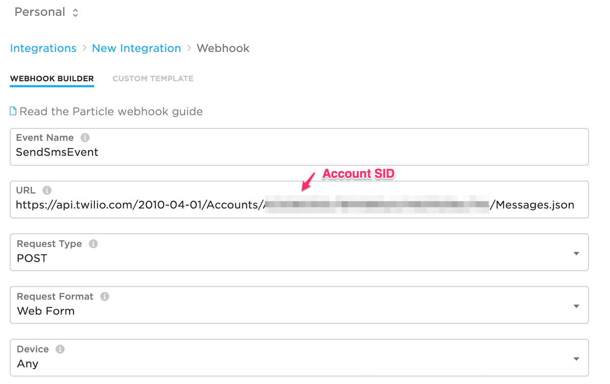

# SmsWebhookRK

*Library for Particle devices to easily send SMS via a webhook to Twilio*

## Using the library

- Add the library to your project. Using Particle Workbench, from the Command Palette **Particle: Install Library** and add **SmsWebhookRK**. It's also avaiable in the community libraries in the Web IDE.

- Add the include statement to your main .ino or .cpp source file:

```cpp
#include "SmsWebhookRK.h"
```

- Add a call from setup():

```cpp
void setup() {
    SmsWebhook::instance().setup();
}
```

- Add a call from loop():

```
void loop() {
    SmsWebhook::instance().loop();
}
```

Note that both setup and loop calls are required! You should make the loop call on every loop; if there is nothing to do it returns quickly.

- To send a SMS message you specify the recipient phone number and the message. Note that the phone number must be in +country code format, so in the United States it will always begin with `+1`.

```cpp
SmsMessage mesg;
mesg.withRecipient("+12125551212")
    .withMessage("testing!");
SmsWebhook::instance().queueSms(msg);
```


## Setup


### Twilio Setup

This method could easily be updated to work with other SMS providers, however you may need to change authentication methods and the keys where the data is stored.

- [Sign up for a trial Twilio account](https://www.twilio.com/try-twilio) if you don't already have an account set up.

- Follow the instructions to [Buy a number](https://www.twilio.com/docs/sms/quickstart/node). Make sure it has SMS enabled!


- In the [Twilio Dashboard](https://www.twilio.com/console) (1), note the **Account SID** (2) and **Auth Token** (3). You'll need these to create the webhook.


### Webhook Setup

- Open the [Particle Console](https://console.particle.io) and select the **Integrations** tab.

- Create a new **Webhook** integration.



- Select an **Event Name**. The default configured in the library is **SendSmsEvent** (case-sensitive!) but you can change it and use the `withEventName()` method to reconfigure the library. They must match and follow event naming rules (1 - 64 ASCII characters; only use letters, numbers, underscores, dashes and slashes. Spaces and special characters should not be used). Also note that the event name is a prefix, so any event name beginning with that string will trigger the webhook.

- Enter the **URL**. Make sure you subtitute your Account SID for `$TWILIO_ACCOUNT_SID`! 

```
https://api.twilio.com/2010-04-01/Accounts/$TWILIO_ACCOUNT_SID/Messages.json
```

- **Request Type: POST** is the default and the correct value.

- **Request Format: Web Form** is the default and the correct value.

- **Device: Any** is the default. You could also restrict the webhook to a specific device so only that device could send SMS messages.

- Open the **Advanced Settings**.


- In **Form Fields** select **Custom**.

  - Enter **From** (case-sensitive) and the SMS phone number you want to send from. This must be a Twilio Programmable Messaging phone number, not your actual phone number! Also note that it must be begin with `+` then country code, so it will begin with `+1` in the United States.
  - Enter **To** and `{{{t}}}` (case-sensitive). The triple curly brackets are required. If you are only going to ever send to your own phone, you could enter your phone number here instead of `{{{t}}}` but make sure it begins with a `+`.
  - Enter **Body** and `{{{b}}}` (case-sensitive). 

- **Query Parameters** should remain empty.

- In **HTTP Basic Auth** enter:

  - In **Username** enter your Account SID. Note that your Account SID goes in two places: the URL and the Username!

  - In **Password** enter your account Auth Token.

- In **HTTP Headers** the default **Content-Type** of `application/x-www-form-urlencoded` is correct.

- Save the Webhook.

## Examples

### examples/01-simple

### more-examples/02-eeprom


## Version History

### 0.0.1 (2021-03-03)

- Initial version
